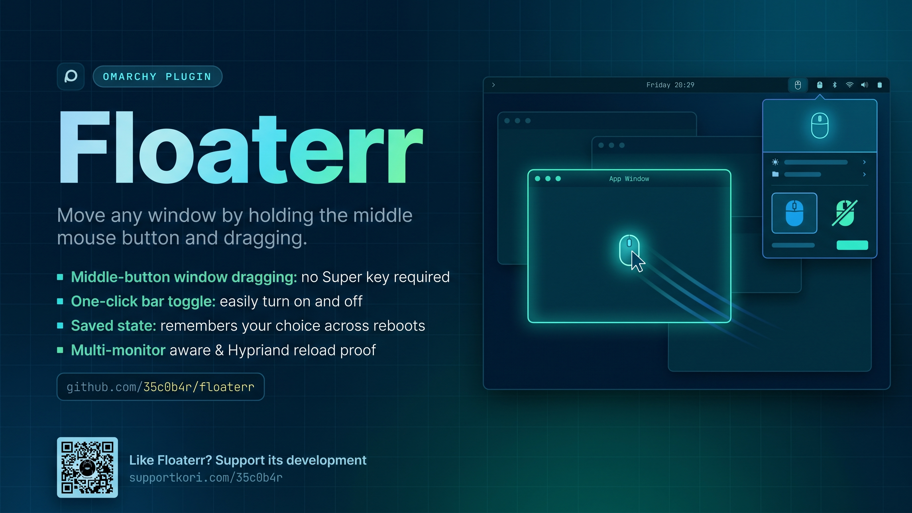

# Floaterr for Omarchy

Move any window by **holding the middle mouse button and dragging**. You don't need to hold Super. A mouse icon in the Omarchy bar turns the feature on and off with one click.

[](preview.mp4)

▶ **[Watch the demo video](preview.mp4)**

## Features

- **Middle-Button Window Dragging**: Hold the middle mouse button over a window and drag to move it, the same move Omarchy gives you with `Super` + left-drag.
- **One-Click Bar Toggle**:
  - **Highlighted mouse** (`󰍽`): Floaterr is on. Middle-button dragging moves windows.
  - **Crossed-out mouse** (`󰍾`): Floaterr is off. Middle-click goes to your apps as usual (paste, open link in new tab, close tab).
- **Remembers Your Choice**: The on/off state is saved and restored after shell restarts, plugin reloads, and reboots.
- **Survives Hyprland Reloads**: The bind is re-applied automatically after every Hyprland config reload.
- **Multi-Monitor Aware**: One shared state drives the icon on every monitor's bar, so they never disagree.
- **Cleans Up After Itself**: Disabling or removing the plugin immediately gives the middle button back to your apps.
- **Scriptable**: Toggle, enable, disable, or query it from a terminal or a keybinding through shell IPC.

## Requirements

- Omarchy with the Quattro shell.
- Hyprland with Lua config support (`hyprctl eval`), as shipped with current Omarchy.

## Installation

### Via Omarchy Marketplace / Plugin Manager

```bash
omarchy plugin add https://github.com/35c0b4r/floaterr --enable
```

The mouse icon appears on the right side of your bar. Move it with:

```bash
omarchy bar move io.github.35c0b4r.floaterr --section center
```

### Manual Installation

Clone this repository into your Omarchy plugins directory, using the plugin ID as the folder name:

```bash
mkdir -p ~/.config/omarchy/plugins
git clone https://github.com/35c0b4r/floaterr ~/.config/omarchy/plugins/io.github.35c0b4r.floaterr
```

Then discover and enable it:

```bash
omarchy-shell shell rescanPlugins
omarchy plugin enable io.github.35c0b4r.floaterr
```

## Removal

```bash
omarchy plugin remove io.github.35c0b4r.floaterr
```

Or disable it and remove `~/.config/omarchy/plugins/io.github.35c0b4r.floaterr` manually. The saved state lives in `~/.local/state/floaterr/` and can be deleted too.

## Keybinding

You can toggle Floaterr with a global Hyprland keyboard shortcut.

Add the following to `~/.config/hypr/bindings.lua`:

```lua
o.bind("SUPER + CTRL + M", "Toggle Floaterr", "omarchy shell floaterr toggle")
```

### Shell IPC Commands

```bash
# Toggle middle-button window dragging
omarchy shell floaterr toggle

# Explicit on / off
omarchy shell floaterr enable
omarchy shell floaterr disable

# Print the current state: "enabled" or "disabled"
omarchy shell floaterr status
```

## Settings

Floaterr needs no configuration. Its only setting is on/off, controlled from the bar icon or the IPC commands above.

| Item | Value |
|---|---|
| Mouse button | Middle (`mouse:274`) |
| Action | Hyprland window drag (`hl.dsp.window.drag()`) |
| Default state | On (first activation) |
| State file | `~/.local/state/floaterr/enabled` (`1` = on, `0` = off; honours `$XDG_STATE_HOME`) |

## How It Works

- A headless **service** owns the state and the bind. The bar draws one widget per monitor, so the state can't live in the widget itself. Each widget reads it from the service.
- When the feature is on, the service runs
  `hyprctl eval 'hl.bind("mouse:274", hl.dsp.window.drag(), { mouse = true })'`.
  When it is off, the service runs `hl.unbind("mouse:274")`. Nothing in your Hyprland config files is changed.
- The service listens for Hyprland's `configreloaded` event and re-applies the bind, because runtime binds are dropped on reload.

## Known Limits

- **Middle-click is taken from apps while Floaterr is on.** Hyprland grabs the button before any window sees it, so middle-click paste, open link in new tab, and close tab stop working. Turn Floaterr off from the bar when you need them.
- **An existing `mouse:274` bind is replaced.** If you bound the middle button yourself in Hyprland, Floaterr unbinds it when it toggles. Re-add your bind after disabling the plugin.
- **The bind only exists while the Omarchy shell is running.** If the shell is stopped, the bind is removed with it.

## Security & Privacy

- **No Network Access**: Floaterr never touches the network.
- **No Privileges**: Runs with your normal user permissions. No `sudo`, no system files, no daemons.
- **No Config File Edits**: The bind is added at runtime through `hyprctl eval`, so nothing in `~/.config/hypr/` is changed.
- **Minimal Footprint**: The only file it writes is the one-byte state file in `~/.local/state/floaterr/`.
- **No Shell Evaluation of Input**: All commands run as fixed argument vectors, and no user-supplied text reaches a shell or Lua.

## Support

Like Floaterr? Support its development at [supportkori.com/35c0b4r](https://www.supportkori.com/35c0b4r).

## License

MIT
